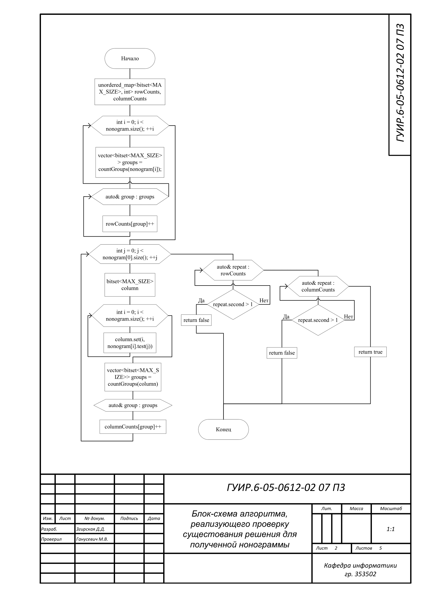
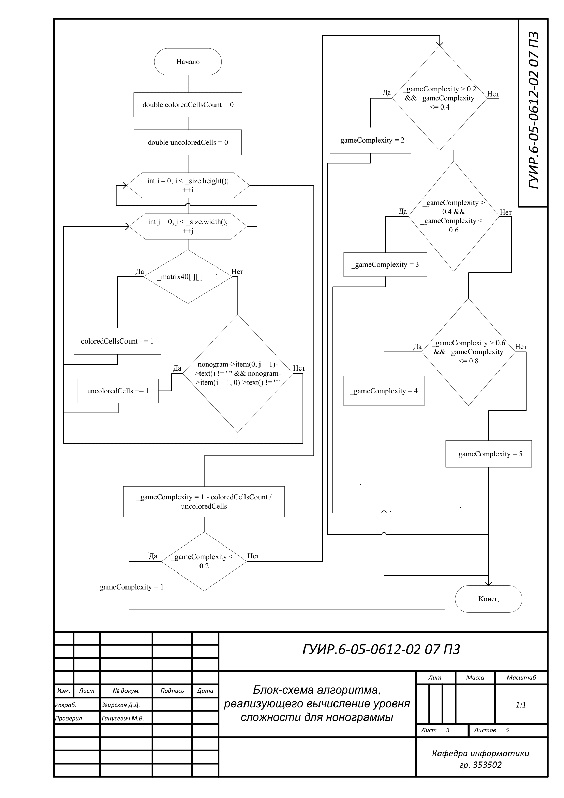
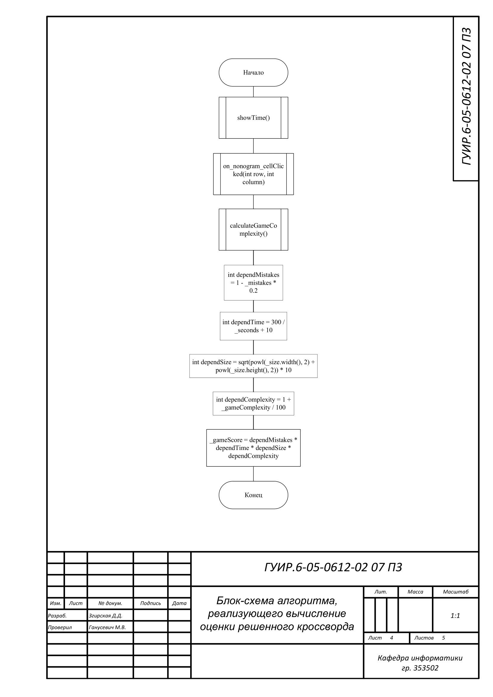

# Реализация игры "Нонограммы"

Данная курсовая работа реализует приложение "Нонограммы" и позволяет создавать головоломки на основе пиксельного изображения.
Нонограмма, или японский кроссворд, – головоломка, в которой с
помощью цифр зашифровано изображение.Целью игры является восстановление изображения с помощью
логических рассуждений.

## Блок-схема алгоритма, реализующего генерацию нонограммы на основе пиксельного изображения

Применяется в: `/Nonogram/Sources/pictureservice.cpp`

## Блок-схема алгоритма, реализующего проверку существования решения для полученной нонограммы

Применяется в: `/Nonogram/Sources/pictureservice.cpp`

## Блок-схема алгоритма, реализующего вычисление уровня сложности для нонограммы

Применяется в: `/Nonogram/Sources/pictureservice.cpp`

## Блок-схема алгоритма, реализующего вычисление оценки решенного кроссворда

Применяется в: `/Nonogram/Sources/pictureservice.cpp`

## Блок-схема алгоритма, реализующего вычисление рейтинга профиля на основе решенных кроссвордов

Применяется в: `/Nonogram/Sources/pictureservice.cpp`

