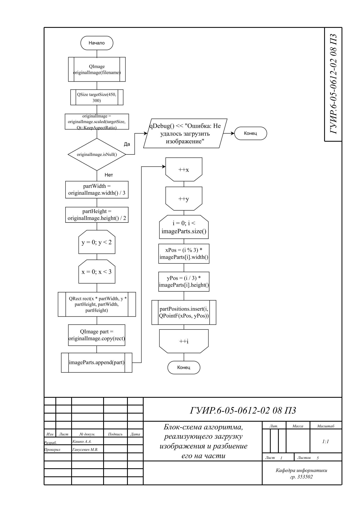
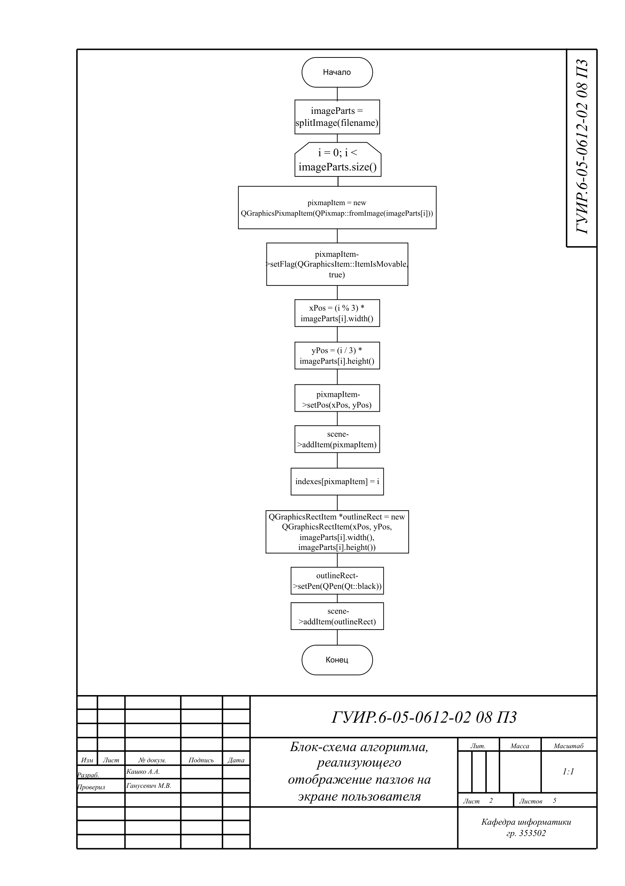
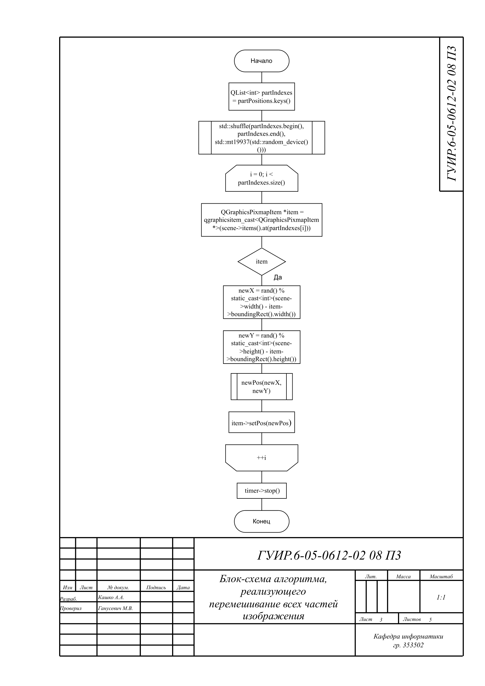
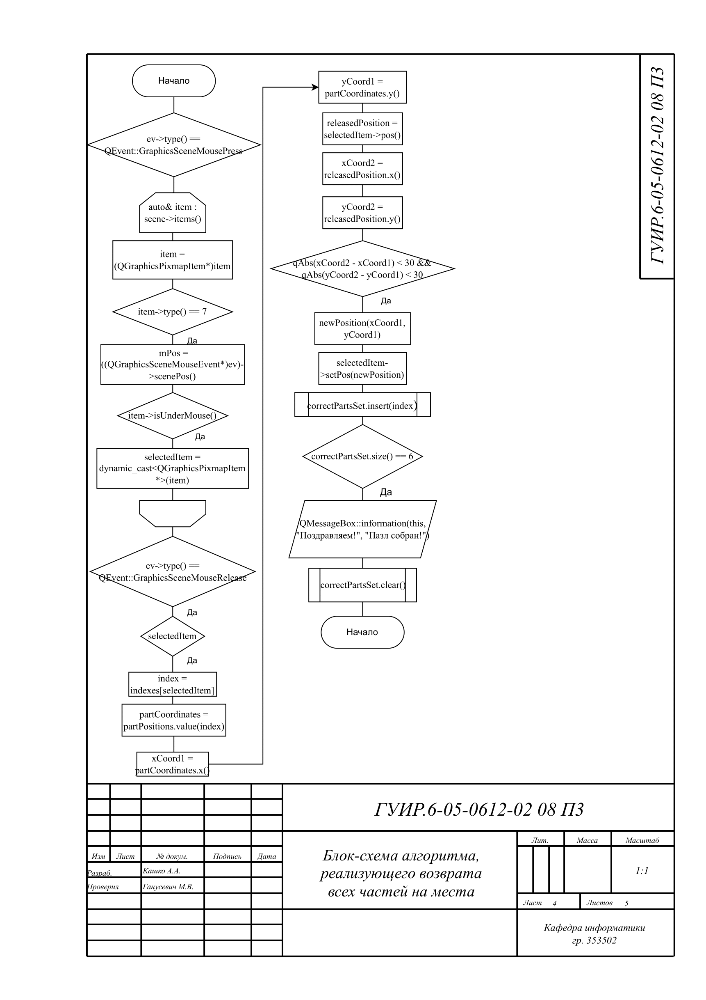

<h2>Создание разноуровневой игры "Пазлы"</h2>

Целью данного курсового проекта является разработка разноуровневой игры-головоломки,
основой которой является игра "Пазлы", предоставляющая пользователям возможность развивать
когнитивные способности, обучаться математическим концепциям и развивать логику.

<h3>Блок-схема алгоритма,реализующего загрузку изображения и разбиения его на части</h3>

Применяется в: helppuzzle.cpp, averagepuzzles.cpp, hardpuzzles.cpp. Алгоритм вызывается методом splitImage и результатом является заполнение массива изображениями - частями пазла

<h3>Блок-схема алгоритма, реализующего отображения пазлов на экране пользователя</h3>

Применяется в: helppuzzle.cpp, averagepuzzles.cpp, hardpuzzles.cpp. Алгоритм вызывается нажатием на кнопку (on_button_StartGame_clicked) и результатом является отображение всех частей пазла на экране пользователя

<h3>Блок-схема алгоритма, реализующего перемешивание всех частей изображения</h3>

Применяется в: helppuzzle.cpp, averagepuzzles.cpp, hardpuzzles.cpp. Алгоритм вызывается методом swapImageParts, результат применяется для отображеня пользователю перемешивания всех кусочков пазла

<h3>Блок-схема алгоритма, реализующего возврат всех частей на места</h3>

Применяется в: helppuzzle.cpp, averagepuzzles.cpp, hardpuzzles.cpp. Алгоритм вызывается методом eventFilter и результат применяется для помощи пользователю собрать пазл: если пользователь хотя бы на 80% верно поставил кусочек,
то он автоматически вернётся на своё зарезервированное место

<h3>Блок-схема алгоритма, реализующего подсказки для пользователя</h3>

Применяется в: helppuzzle.cpp, averagepuzzles.cpp, hardpuzzles.cpp. Алгоритм вызывается нажатием на кнопку (on_button_HelpUser_clicked), результат применяется для отображеня оригинальной версии пазла, чтобы пользователь мог
вспомнить саму картинку

