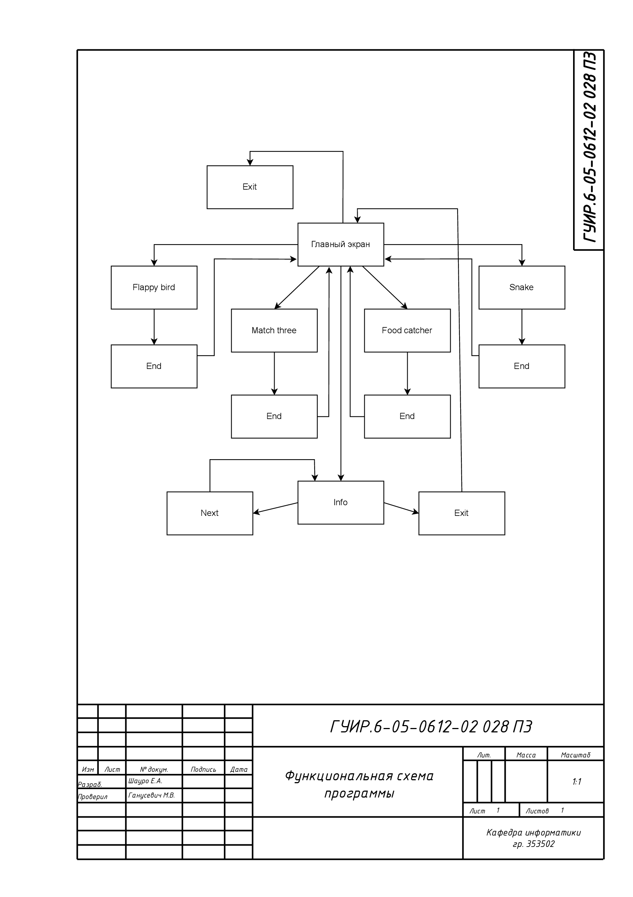
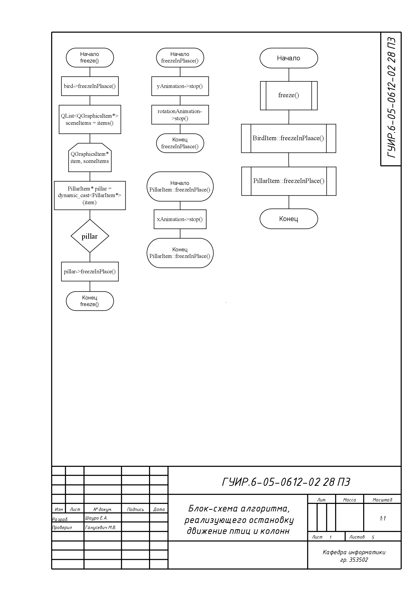
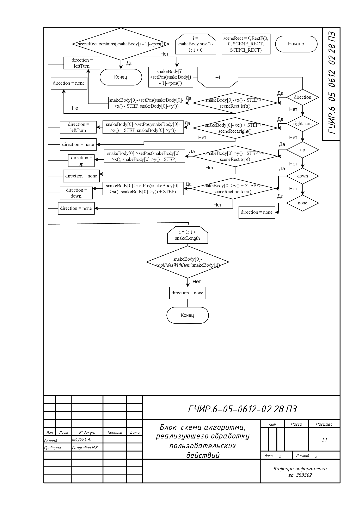
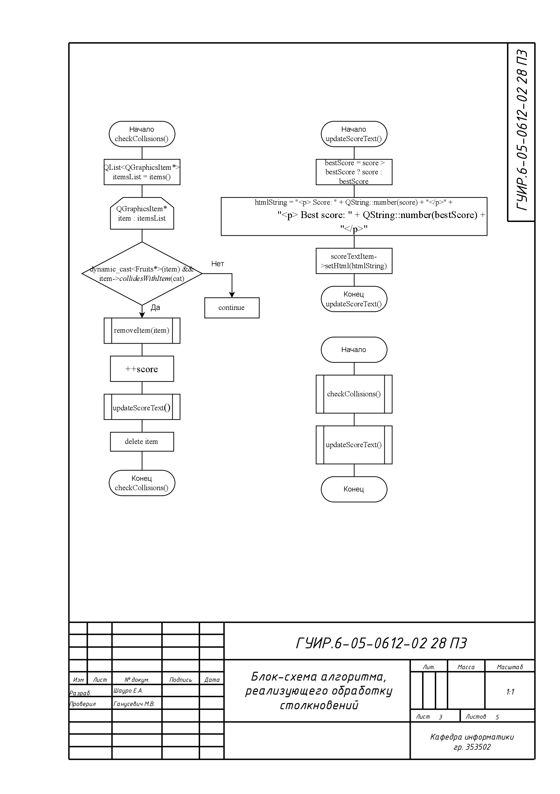
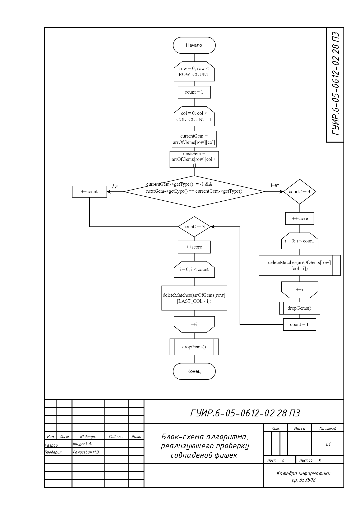
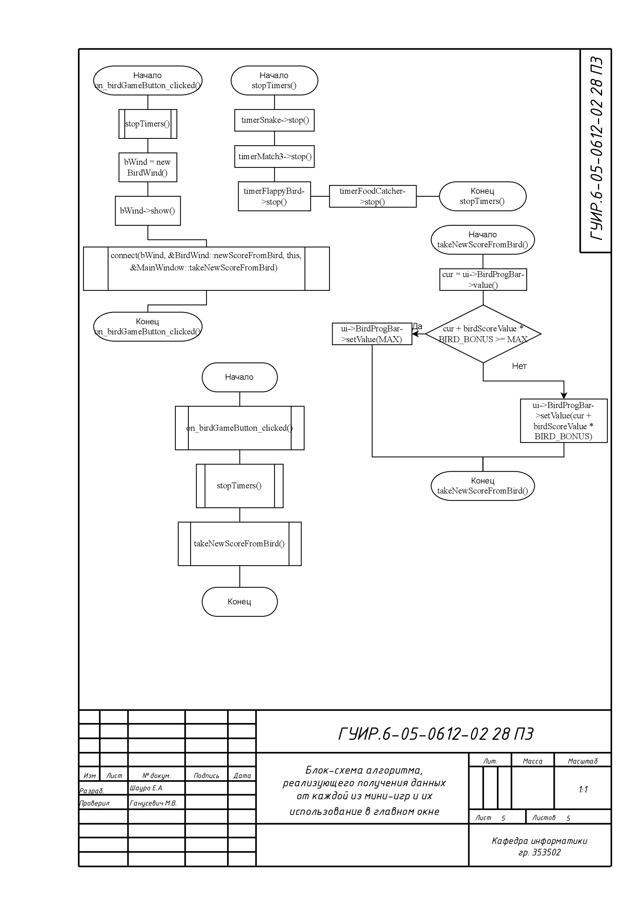

<h2>Создание игры по уходу за питомцем</h2>

Целью данного курсового проекта является разработка игры в жанре тамагочи,
основная идея которой немного изменена ввиду отсутствия внутриигрового
магазина. Пользователю необходимо следить за балансом между четырьмя
характеристиками, шкала роста которых зависит от успеха в четырех
соответствующих мини-играх.

<h3>Функциональная блок-схема программы</h3>

<h3>Блок-схема алгоритма, реализующего остановку игры Flappy Bird</h3>

Применяется в B_Scene.cpp по истечению таймера. Результатом становится завершение игры и заморозка птицы и колонн на месте

<h3>Блок-схема алгоритма, отвечающего за обработку пользовательских действий в игре Snake</h3>

Применяется в S_snake.cpp Алгоритм вызывается методом move() и результатом является обновление направления движения змейки

<h3>Блок-схема алгоритма, реализующего обработку столкновений в игре Food Catcher</h3>

Применяется в F_Scene.cpp. Алгоритм проверяет на столкновение падающий объект и объект игрока и обновляет надпись со счетом 

<h3>Блок-схема алгоритма, котоорый проверяет фишки на совпадения по горизонтали в Match Three</h3>

Применяется в M3_scene.cpp. Алгоритм вызывается при инициализации игрового поля и после пользовательских действий

<h3>Блок-схема алгоритма, реализующего получение данных от каждой из мини-игр и использование их в главном окне (на примере игры Flappy Bird)</h3>

Применяется в mainwindow.cpp и обновляет соответствующие прогресс-бары в соответствии с набранными очками в мини-игре

